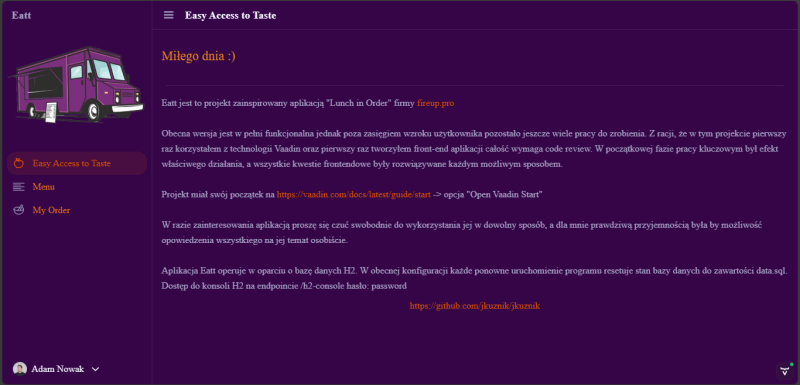
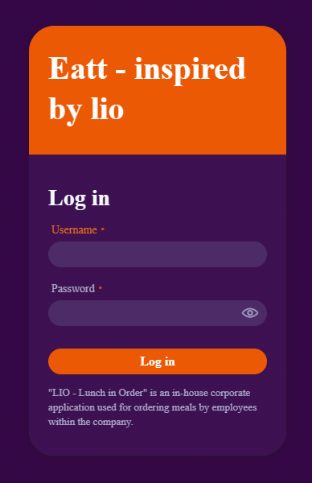
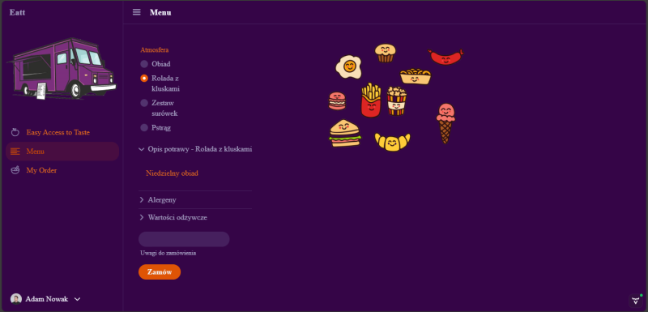
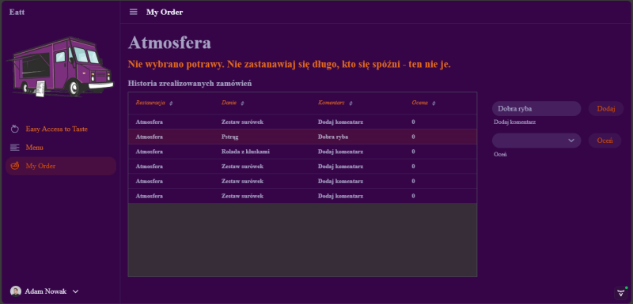
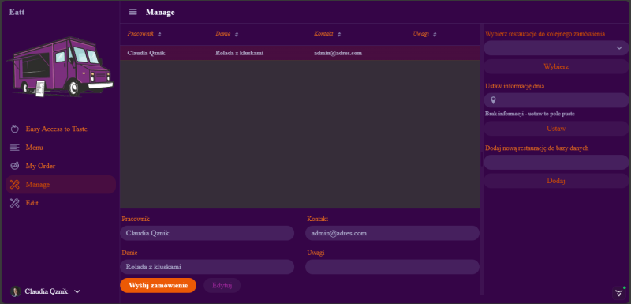
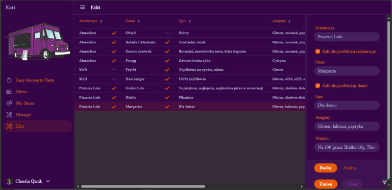

# Eatt! - Easy Access to Taste

"Eatt" is a project inspired by the "Lunch in Order" application developed by [fireup.pro](https://fireup.pro). This web application serves as an in-company platform for employees of the company to order their lunch for the next working day.

# Knowledge gained

Creating this project involved using technologies such as:
- Spring Boot Framework
- Maven
- Vaadin
- H2 Database
- --
The solutions used allowed me to explore the capabilities of Vaadin as a tool for building the front-end of the application, also expanded my knowledge of the general operation of SQL databases, and the H2 technologies were something I had the opportunity to learn for the first time. The encountered issues, among others, were also related to the need to configure Spring Security.
In the application, unit tests are included to ensure its functionality and reliability. These tests are written using the Mockito library to facilitate mocking and verification of interactions.

## Features

**User authentication** - Each employee has their own account. The accounts are divided into roles: user and admin.
 
**User account** - Regular users have the ability to order meals for themselves from the list for the next working day. There is also an option to add ratings and comments to meals that have already been fulfilled.
 
 
**Admin account** - This accout belongs to a person in the company responsible for lunch orders. The application provides such person with the ability to choose a restaurant from which the next order will be placed, add additional restaurants, and update the menu for each restaurant  It is possible to mark a restaurant and each dish individually as temporarily or permanently unavailable. The application includes a time lock for placing orders, but the administrator is authorized to edit orders at any time. The administrator also has the ability to set information to be communicated to employees
 
 
**Time lock** - The ability to set until what time orders can be placed.

**Welcome information** - The ability to convey corporate information or provide a space for randomly selected positive sentences.

## TODO

- Add integration tests
- To ensure easy and portable application management, it is necessary to provide the ability to use it from a Docker container.
- Create of documentation
- Improving this README
- Integration of the application with Google services

## Running the application

The project is a standard Maven project. To run it from the command line,
type `mvnw` (Windows), or `./mvnw` (Mac & Linux), then open
http://localhost:8080 in your browser.

You can also import the project to your IDE of choice as you would with any
Maven project. Read more on [how to import Vaadin projects to different IDEs](https://vaadin.com/docs/latest/guide/step-by-step/importing) (Eclipse, IntelliJ IDEA, NetBeans, and VS Code).

## Deploying to Production

To create a production build, call `mvnw clean package -Pproduction` (Windows),
or `./mvnw clean package -Pproduction` (Mac & Linux).
This will build a JAR file with all the dependencies and front-end resources,
ready to be deployed. The file can be found in the `target` folder after the build completes.

Once the JAR file is built, you can run it using
`java -jar target/eatt-1.0-SNAPSHOT.jar`

## Project structure

- `MainLayout.java` in `src/main/java` contains the navigation setup (i.e., the
  side/top bar and the main menu). This setup uses
  [App Layout](https://vaadin.com/docs/components/app-layout).
- `views` package in `src/main/java` contains the server-side Java views of your application.
- `views` folder in `frontend/` contains the client-side JavaScript views of your application.
- `themes` folder in `frontend/` contains the custom CSS styles.

## Useful links

- Read the documentation at [vaadin.com/docs](https://vaadin.com/docs).
- Follow the tutorial at [vaadin.com/docs/latest/tutorial/overview](https://vaadin.com/docs/latest/tutorial/overview).
- Create new projects at [start.vaadin.com](https://start.vaadin.com/).
- Search UI components and their usage examples at [vaadin.com/docs/latest/components](https://vaadin.com/docs/latest/components).
- View use case applications that demonstrate Vaadin capabilities at [vaadin.com/examples-and-demos](https://vaadin.com/examples-and-demos).
- Build any UI without custom CSS by discovering Vaadin's set of [CSS utility classes](https://vaadin.com/docs/styling/lumo/utility-classes). 
- Find a collection of solutions to common use cases at [cookbook.vaadin.com](https://cookbook.vaadin.com/).
- Find add-ons at [vaadin.com/directory](https://vaadin.com/directory).
- Ask questions on [Stack Overflow](https://stackoverflow.com/questions/tagged/vaadin) or join our [Discord channel](https://discord.gg/MYFq5RTbBn).
- Report issues, create pull requests in [GitHub](https://github.com/vaadin).
